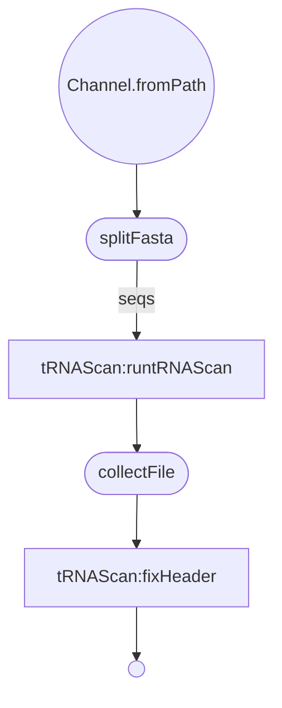

# Nextflow Conversion of tRNAScanTask.pm

***
tRNAScan
***  

Decription of nextflow configuration parameters:
| param         | value type        | description  |
| ------------- | ------------- | ------------ |
| inputFilePath | string | Path to the input fasta file. |
| outputDir | string | Path to where you would like output files to be stored. |
| outputFileName | string | How you would like this output file to be stored. |
| fastaSubsetSize | integer | How many sequences you would like to have sent to each process at a time. |

### Get Started
  * Install Nextflow
    
    `curl https://get.nextflow.io | bash`
  
  * Run the script
    
    `nextflow run VEuPathDB/tRNAScan -with-trace -c  <config_file> -r main`
