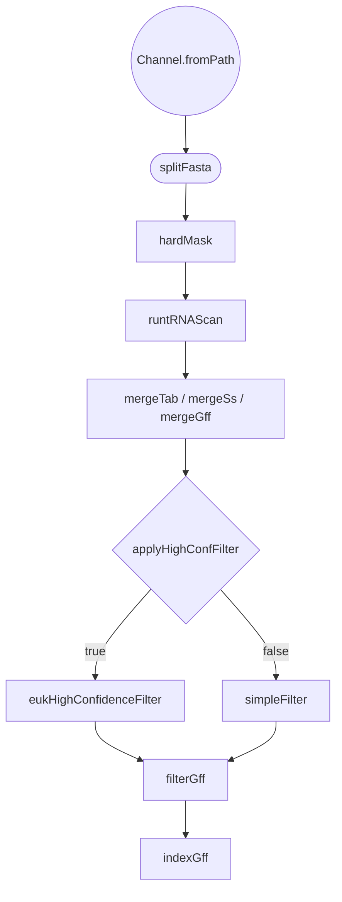

THIS REPO IS 🚧 UNDER CONSTRUCTION 🚧 and NOT Used in ANY production CODE
# Nextflow Conversion of tRNAScanTask.pm

***
tRNAScan
***  

```mermaid
flowchart TD
    p0((Channel.fromPath))
    p1([splitFasta])
    p2[hardMask]
    p3[runtRNAScan]
    p4[mergeTab / mergeSs / mergeGff]
    p5{applyHighConfFilter}
    p6[eukHighConfidenceFilter]
    p7[simpleFilter]
    p8[filterGff]
    p9[indexGff]
    p0 --> p1 --> p2 --> p3 --> p4 --> p5
    p5 -->|true| p6
    p5 -->|false| p7
    p6 --> p8
    p7 --> p8
    p8 --> p9
```

Decription of nextflow configuration parameters:
| param         | value type        | description  |
| ------------- | ------------- | ------------ |
| inputFilePath | string | Path to the input fasta file. |
| outputDir | string | Path to where you would like output files to be stored. |
| outputFileName | string | How you would like this output file to be stored. |
| fastaSubsetSize | integer | How many sequences you would like to have sent to each process at a time. |
| applyHighConfFilter | boolean | true = EukHighConfidenceFilter (retain only the high confidence set); false = simple pseudo/score filter. |
| cmScore | integer | EukHighConfidenceFilter domain/overall model score cutoff (-c1, default 50). |
| ssScore | integer | EukHighConfidenceFilter secondary structure score cutoff (-m1, default 10). |
| isoScore | integer | EukHighConfidenceFilter isotype-specific model score cutoff (-e1, default 70). |
| minInfScore | integer | Infernal score cutoff for the simple filter path (default 60). |
| maxForks | integer | Max concurrent processes in the docker profile, for local runs (default 2). |

### Get Started
  * Install Nextflow
    
    `curl https://get.nextflow.io | bash`
  
  * Run the script
    
    `nextflow run VEuPathDB/tRNAScan -with-trace -c  <config_file> -r main`
