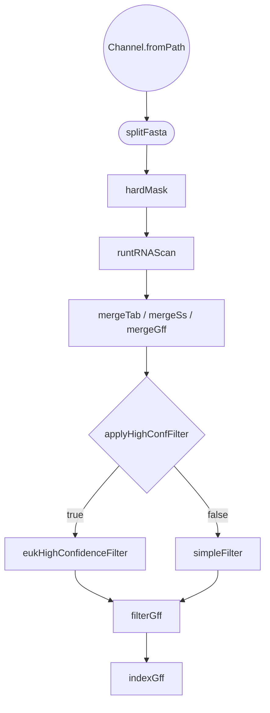

# EukHighConfidenceFilter Filtering Implementation Plan

> **For agentic workers:** REQUIRED SUB-SKILL: Use superpowers:subagent-driven-development (recommended) or superpowers:executing-plans to implement this plan task-by-task. Steps use checkbox (`- [ ]`) syntax for tracking.

**Goal:** Replace the hand-rolled `strictFilter` with tRNAscan-SE's bundled `EukHighConfidenceFilter`, retaining only the `high confidence set`, and validate retained counts against local gold-standard genomes.

**Architecture:** `EukHighConfidenceFilter` cross-keys the merged tabular `.out` and merged `.ss`, so the pipeline merges both (a new `mergeSs` plus a header-safe `mergeGff` replacing the buggy `collectFile(skip:1)`), runs the filter in tag-only mode with tunable score cutoffs, selects `high confidence set` with a line-level match, and feeds a shared `filterGff` process that both the strict and simple paths reuse.

**Tech Stack:** Nextflow DSL2, `veupathdb/trnascan:1.0.0` container (tRNAscan-SE 2.0.12 + EukHighConfidenceFilter), `seqkit` container, awk/bash. Verification is by running the pipeline on bundled test data under `-profile docker`; there is no unit-test framework.

**Spec:** `docs/superpowers/specs/2026-07-22-eukhighconfidencefilter-filtering-design.md`

**Conventions used below:**
- `$SCRATCH` = `/tmp/claude-1000/-home-jbrestel-workspaces-misc-trna-scan-nextflow/72c651bb-dd54-4b12-9b45-00988dfffb72/scratchpad`
- `LATEST_WORKDIR() { proc=$1; nextflow log $(nextflow log | tail -n 1 | cut -f3) -f process,workdir | grep "$proc" | head -1 | cut -f2; }` — inspect a process's work dir (matches the user's standard workflow).
- All pipeline runs use `-profile docker` (the default profile enables no container engine).

---

## File Structure

- `modules/tRNAScan.nf` — **modify**: add `mergeSs`, `mergeGff`, `eukHighConfidenceFilter`, `filterGff`; slim `simpleFilter`; remove `strictFilter`; rewire `workflow tRNAScan`.
- `nextflow.config` — **modify**: add `cmScore`, `ssScore`, `isoScore`; flip `applyHighConfFilter` to `true`.
- `modules/templates/fixHeader.bash` — **delete** (dead).
- `README.md` — **modify**: refresh flow diagram + param table.
- `$SCRATCH/gold_compare.sh` — **create** (validation, not committed).

---

## Task 1: De-risk — prove EukHighConfidenceFilter behavior on a real fixture

No repo changes. Establishes expected outputs before building around the tool.

**Files:**
- Create: `$SCRATCH/make_fixture.sh` (throwaway)

- [ ] **Step 1: Write the fixture script**

Create `$SCRATCH/make_fixture.sh`:

```bash
#!/usr/bin/env bash
set -euo pipefail
SCRATCH="/tmp/claude-1000/-home-jbrestel-workspaces-misc-trna-scan-nextflow/72c651bb-dd54-4b12-9b45-00988dfffb72/scratchpad"
mkdir -p "$SCRATCH/fixture/tmp"
cd "$(git rev-parse --show-toplevel)"

# Run tRNAscan-SE exactly as the pipeline will (-E -H --detail -f), on the larger
# bundled genome so we get non-trivial high-confidence hits.
docker run --rm -u "$(id -u):$(id -g)" -v "$PWD":/work -v "$SCRATCH":"$SCRATCH" -w /work \
  veupathdb/trnascan:1.0.0 bash -c "
    perl -e 'while(<>){if(/^temp_dir:/){print \"temp_dir: $SCRATCH/fixture/tmp\n\"}else{print}}' \
      /usr/bin/tRNAscan-SE.conf > $SCRATCH/fixture/conf
    tRNAscan-SE -E data/genomicSeqs.fa -o $SCRATCH/fixture/fix.out \
      --conf $SCRATCH/fixture/conf --gff $SCRATCH/fixture/fix.gff \
      -f $SCRATCH/fixture/fix.ss --detail -H
    EukHighConfidenceFilter -i $SCRATCH/fixture/fix.out -s $SCRATCH/fixture/fix.ss \
      -o $SCRATCH/fixture -p hiConf
"
echo '=== hiConf.out header (first 3 lines) ==='
head -3 "$SCRATCH/fixture/hiConf.out"
echo '=== Note-tag category counts ==='
awk 'NR>3{ n=index($0,"high confidence set"); print (n?"high confidence set":$NF) }' \
  "$SCRATCH/fixture/hiConf.out" | sort | uniq -c
echo '=== high confidence set count (line-level match) ==='
awk 'NR>3 && /high confidence set/' "$SCRATCH/fixture/hiConf.out" | wc -l
echo '=== EukHCF log ==='
cat "$SCRATCH/fixture/hiConf.log"
```

- [ ] **Step 2: Run it and confirm behavior**

Run: `bash $SCRATCH/make_fixture.sh`
Expected:
- `hiConf.out` has a 3-line tRNAscan-SE-style header.
- Category counts include a non-zero `high confidence set` plus some of `pseudo` / `secondary filtered` / `isotype mismatch`.
- The line-level `high confidence set` count is > 0 and ≤ total data rows.
- `hiConf.log` prints a per-category summary.

If `high confidence set` is zero, stop and report — the thresholds or input flags need revisiting before proceeding.

- [ ] **Step 3: Record the expected numbers**

Note the `high confidence set` count and category breakdown in the task tracker; Task 5 asserts the pipeline reproduces them on `genomicSeqs.fa`. No commit (scratch only).

---

## Task 2: Add filtering params

**Files:**
- Modify: `nextflow.config:8-13`

- [ ] **Step 1: Replace the Filtering param block**

In `nextflow.config`, replace the current filtering comment + `applyHighConfFilter`/`minInfScore` lines with:

```groovy
  // Filtering
  // applyHighConfFilter = true  -> eukHighConfidenceFilter (tRNAscan-SE's bundled
  //   EukHighConfidenceFilter; retains only the "high confidence set")
  // applyHighConfFilter = false -> simpleFilter (drop pseudo + Inf score cutoff)
  applyHighConfFilter = true
  minInfScore = 60           // simpleFilter path only

  // EukHighConfidenceFilter score cutoffs (tool defaults)
  cmScore  = 50              // -c1 domain/overall model score
  ssScore  = 10              // -m1 secondary structure score
  isoScore = 70              // -e1 isotype-specific model score
```

- [ ] **Step 2: Verify Nextflow parses the config**

Run: `nextflow config -profile docker | grep -E 'applyHighConfFilter|cmScore|ssScore|isoScore|minInfScore'`
Expected: all five params printed with the values above (`applyHighConfFilter = true`, `cmScore = 50`, `ssScore = 10`, `isoScore = 70`, `minInfScore = 60`).

- [ ] **Step 3: Commit**

```bash
git add nextflow.config
git commit -m "Add EukHighConfidenceFilter score params; default strict filter on"
```

---

## Task 3: Add mergeSs and mergeGff; rewire merges

**Files:**
- Modify: `modules/tRNAScan.nf` (add two processes after `mergeTab`; edit `workflow tRNAScan`)

- [ ] **Step 1: Add the `mergeSs` process**

Insert after the `mergeTab` process (after `modules/tRNAScan.nf:76`):

```groovy
// ---------------------------------------------------------------------------
// Concatenate per-chunk secondary-structure files into one .ss file.
// EukHighConfidenceFilter cross-keys .ss records (by sequence name) against the
// merged tabular output, so it needs the whole set in one file.
// ---------------------------------------------------------------------------
process mergeSs {
  input:
  path ssFiles, stageAs: '*.ss'

  output:
  path 'merged.ss'

  script:
  """
  cat ${ssFiles} > merged.ss
  """
}

// ---------------------------------------------------------------------------
// Merge per-chunk GFF3 with a single clean header.
// Replaces collectFile(skip:1), which stripped only one line per chunk and left
// duplicate/renumbered ## header lines interleaved in the output.
// ---------------------------------------------------------------------------
process mergeGff {
  input:
  path gffFiles, stageAs: '*.gff'

  output:
  path 'merged.gff'

  script:
  """
  echo '##gff-version 3' > merged.gff
  for f in ${gffFiles}; do
    grep -v '^#' \$f >> merged.gff || true
  done
  """
}
```

- [ ] **Step 2: Rewire the merges in `workflow tRNAScan`**

In `workflow tRNAScan`, replace the Step 3 merge lines (`modules/tRNAScan.nf:224-227`):

```groovy
  // Step 3: Merge outputs
  // mergeTab uses explicit header to avoid collectFile(keepHeader:true) bug
  mergedTab = mergeTab(trnascanResults.tab.collect())
  mergedGff = trnascanResults.gff.collectFile(name: 'merged.gff', keepHeader: false, skip: 1)
```

with:

```groovy
  // Step 3: Merge outputs (tab + ss + gff), each with correct header handling
  mergedTab = mergeTab(trnascanResults.tab.collect())
  mergedSs  = mergeSs(trnascanResults.ss.collect())
  mergedGff = mergeGff(trnascanResults.gff.collect())
```

- [ ] **Step 3: Run the pipeline (strict path may fail at the filter step — expected for now)**

The `eukHighConfidenceFilter` process does not exist yet, so also temporarily set the toggle off for this run:

Run: `nextflow run main.nf -profile docker --applyHighConfFilter false`
Expected: pipeline reaches at least `mergeSs`/`mergeGff`. (It will run through `simpleFilter`, which still works.)

- [ ] **Step 4: Verify merged outputs in the work dir**

Run:
```bash
run=$(nextflow log | tail -n 1 | cut -f3)
ss=$(nextflow log $run -f process,workdir | grep mergeSs | head -1 | cut -f2)
gff=$(nextflow log $run -f process,workdir | grep mergeGff | head -1 | cut -f2)
echo "merged.ss records:"; grep -c '^>' "$ss/merged.ss" || grep -c 'Type:' "$ss/merged.ss"
echo "gff-version lines (must be exactly 1):"; grep -c '^##gff-version' "$gff/merged.gff"
echo "other ## header lines (must be 0):"; grep -c '^##' "$gff/merged.gff"
```
Expected: `merged.ss` non-empty; exactly **1** `##gff-version` line; the total `##` count is also 1 (no stray headers).

- [ ] **Step 5: Commit**

```bash
git add modules/tRNAScan.nf
git commit -m "Add mergeSs and header-safe mergeGff; wire into workflow"
```

---

## Task 4: Extract shared filterGff; slim simpleFilter

**Files:**
- Modify: `modules/tRNAScan.nf` (add `filterGff`; rewrite `simpleFilter`; edit workflow)

- [ ] **Step 1: Add the `filterGff` process**

Insert before `indexGff` (before `modules/tRNAScan.nf:187`):

```groovy
// ---------------------------------------------------------------------------
// Filter the merged GFF to the coordinates retained in the filtered .out.
// Shared by both the strict (EukHCF) and simple filter paths.
// Strand is normalized to min..max to match GFF start<end convention.
// ---------------------------------------------------------------------------
process filterGff {
  publishDir params.outputDir, mode: 'copy', pattern: 'filtered.gff'

  input:
  path retainedTab
  path mergedGff

  output:
  path 'filtered.gff'

  script:
  """
  awk 'NR>3 {
    start = (\$3 < \$4) ? \$3 : \$4
    end   = (\$3 < \$4) ? \$4 : \$3
    print \$1"\t"start"\t"end
  }' ${retainedTab} > hc_coords.txt

  awk 'NR==FNR {coords[\$1"\t"\$2"\t"\$3]=1; next}
       /^#/ {print; next}
       {if (coords[\$1"\t"\$4"\t"\$5]) print}' hc_coords.txt ${mergedGff} > filtered.gff
  """
}
```

- [ ] **Step 2: Rewrite `simpleFilter` to drop its inline GFF join**

Replace the entire `simpleFilter` process (`modules/tRNAScan.nf:149-182`) with:

```groovy
// ---------------------------------------------------------------------------
// Simple filter for small genomes (applyHighConfFilter = false):
// drop pseudogenes and low-scoring hits. GFF join is delegated to filterGff.
// Uses $NF for the note field to handle the --detail -H column layout.
// ---------------------------------------------------------------------------
process simpleFilter {
  container 'veupathdb/trnascan:1.0.0'
  publishDir params.outputDir, mode: 'copy', pattern: 'tRNAScan.out'

  input:
  path mergedTab

  output:
  path 'tRNAScan.out', emit: tab

  script:
  """
  head -3 ${mergedTab} > tRNAScan.out
  awk -v minscore=${params.minInfScore} '
    NR>3 &&
    \$NF !~ /pseudo/ &&
    \$9+0 >= minscore {print}
  ' ${mergedTab} >> tRNAScan.out

  echo "Retained \$(awk 'NR>3' tRNAScan.out | wc -l) tRNAs after simple filtering" >&2
  """
}
```

- [ ] **Step 3: Rewire the filter/index tail of `workflow tRNAScan`**

Replace the Step 4 + Step 5 block (`modules/tRNAScan.nf:229-237`) with:

```groovy
  // Step 4: Filter (strict = EukHighConfidenceFilter, simple = score/pseudo)
  if (params.applyHighConfFilter) {
    filtered = eukHighConfidenceFilter(mergedTab, mergedSs)
  } else {
    filtered = simpleFilter(mergedTab)
  }

  // Step 5: Sync GFF to the retained set, then index
  filteredGff = filterGff(filtered.tab, mergedGff)
  indexGff(filteredGff, params.outputGFFName)
```

(`eukHighConfidenceFilter` is added in Task 5; this run uses the `false` branch.)

- [ ] **Step 4: Run the simple path end-to-end**

Run: `nextflow run main.nf -profile docker --applyHighConfFilter false`
Expected: completes; publishes `tRNAScan.out`, `filtered.gff`, and the indexed `.gz`/`.gz.tbi` to `output/`.

- [ ] **Step 5: Verify GFF/out consistency**

Run:
```bash
out=output/tRNAScan.out
echo "retained tRNAs:"; awk 'NR>3' "$out" | wc -l
echo "gff feature lines:"; grep -vc '^#' output/filtered.gff
```
Expected: GFF feature-line count is ≥ 1 and consistent with the retained rows (equal if tRNAscan emits one line per tRNA).

- [ ] **Step 6: Commit**

```bash
git add modules/tRNAScan.nf
git commit -m "Extract shared filterGff; slim simpleFilter to filtering only"
```

---

## Task 5: Add eukHighConfidenceFilter (replaces strictFilter behavior)

**Files:**
- Modify: `modules/tRNAScan.nf` (add process; strict branch already wired in Task 4)

- [ ] **Step 1: Add the `eukHighConfidenceFilter` process**

Insert where `strictFilter` currently sits (replace it is Task 6; add this alongside for now, after `mergeGff`):

```groovy
// ---------------------------------------------------------------------------
// High-confidence filter using tRNAscan-SE's bundled EukHighConfidenceFilter.
// Run in tag-only mode (no -r) so the full tagged output and the .log category
// breakdown survive for diagnosing count gaps; then retain only the
// "high confidence set". The tag is three words, so the match is LINE-LEVEL,
// not $NF (which would only see "set").
// ---------------------------------------------------------------------------
process eukHighConfidenceFilter {
  container 'veupathdb/trnascan:1.0.0'
  publishDir params.outputDir, mode: 'copy', pattern: 'tRNAScan.out'
  publishDir params.outputDir, mode: 'copy', pattern: 'hiConf.log'

  input:
  path mergedTab
  path mergedSs

  output:
  path 'tRNAScan.out', emit: tab
  path 'hiConf.log',   emit: log

  script:
  """
  EukHighConfidenceFilter -i ${mergedTab} -s ${mergedSs} -o . -p hiConf \
      -c1 ${params.cmScore} -m1 ${params.ssScore} -e1 ${params.isoScore}

  head -3 hiConf.out > tRNAScan.out
  awk 'NR>3 && /high confidence set/' hiConf.out >> tRNAScan.out

  echo "Retained \$(awk 'NR>3' tRNAScan.out | wc -l) tRNAs (high confidence set)" >&2
  """
}
```

- [ ] **Step 2: Run the strict path on the fixture genome**

Run: `nextflow run main.nf -profile docker --inputFilePath "$PWD/data/genomicSeqs.fa"`
(`applyHighConfFilter` now defaults to `true`.)
Expected: completes; publishes `tRNAScan.out`, `hiConf.log`, `filtered.gff`, indexed GFF.

- [ ] **Step 3: Verify counts match the Task 1 fixture**

Run:
```bash
echo "pipeline high-confidence count:"; awk 'NR>3' output/tRNAScan.out | wc -l
echo "--- pipeline log ---"; cat output/hiConf.log
```
Expected: the retained count **equals** the `high confidence set` count recorded in Task 1, and `hiConf.log` shows the same category breakdown. A mismatch means the merge step altered the input EukHCF sees — investigate `merged.ss`/`merged.tab` keying before continuing.

- [ ] **Step 4: Verify only high-confidence tags remain**

Run: `awk 'NR>3 && !/high confidence set/' output/tRNAScan.out | wc -l`
Expected: `0` (every retained row carries the tag).

- [ ] **Step 5: Commit**

```bash
git add modules/tRNAScan.nf
git commit -m "Add eukHighConfidenceFilter; retain only high confidence set"
```

---

## Task 6: Remove dead strictFilter and fixHeader.bash

**Files:**
- Modify: `modules/tRNAScan.nf` (delete `strictFilter`)
- Delete: `modules/templates/fixHeader.bash`

- [ ] **Step 1: Delete the `strictFilter` process**

Remove the entire `strictFilter` process block and its preceding comment header (`modules/tRNAScan.nf:78-143` in the original numbering — the block starting `// Apply a strict flag-based filter ...` through the process's closing brace). Confirm no remaining references:

Run: `grep -n strictFilter modules/tRNAScan.nf`
Expected: no output.

- [ ] **Step 2: Delete the dead template**

```bash
git rm modules/templates/fixHeader.bash
```

- [ ] **Step 3: Smoke-test both paths still run**

Run:
```bash
nextflow run main.nf -profile docker
nextflow run main.nf -profile docker --applyHighConfFilter false
```
Expected: both complete and publish `tRNAScan.out` + indexed GFF.

- [ ] **Step 4: Commit**

```bash
git add modules/tRNAScan.nf
git commit -m "Remove dead strictFilter process and unused fixHeader.bash"
```

---

## Task 7: Refresh README

**Files:**
- Modify: `README.md:5-26`

- [ ] **Step 1: Replace the mermaid diagram**

Replace the current diagram (`README.md:5-18`) with:



- [ ] **Step 2: Extend the param table**

Add these rows to the param table (after the `fastaSubsetSize` row, `README.md:26`):

```markdown
| applyHighConfFilter | boolean | true = EukHighConfidenceFilter (high confidence set only); false = simple pseudo/score filter. |
| cmScore | integer | EukHighConfidenceFilter domain/overall model score cutoff (-c1, default 50). |
| ssScore | integer | EukHighConfidenceFilter secondary structure score cutoff (-m1, default 10). |
| isoScore | integer | EukHighConfidenceFilter isotype-specific model score cutoff (-e1, default 70). |
| minInfScore | integer | Infernal score cutoff for the simple filter path (default 60). |
```

- [ ] **Step 3: Verify the diagram renders**

Run: `grep -c 'eukHighConfidenceFilter' README.md`
Expected: `1` (diagram updated; no leftover `fixHeader` reference — confirm with `grep -c fixHeader README.md` → `0`).

- [ ] **Step 4: Commit**

```bash
git add README.md
git commit -m "Update README flow diagram and param table for EukHCF filtering"
```

---

## Task 8: Gold-standard count comparison (validation)

**Blocked on user input:** local gold FASTA paths + expected counts (a two-column `fasta<TAB>expected_count` file). Not committed to the repo.

**Files:**
- Create: `$SCRATCH/gold_compare.sh`

- [ ] **Step 1: Write the comparison script**

Create `$SCRATCH/gold_compare.sh`:

```bash
#!/usr/bin/env bash
set -euo pipefail
# Usage: gold_compare.sh gold_list.tsv    (each line: /path/genome.fa <TAB> expected_count)
SCRATCH="/tmp/claude-1000/-home-jbrestel-workspaces-misc-trna-scan-nextflow/72c651bb-dd54-4b12-9b45-00988dfffb72/scratchpad"
LIST="$1"
cd "$(git rev-parse --show-toplevel)"
printf 'genome\tpipeline\tgold\tdelta\n'
while IFS=$'\t' read -r fasta gold; do
  [ -z "$fasta" ] && continue
  outdir="$SCRATCH/gold_out/$(basename "$fasta" .fa)"
  mkdir -p "$outdir"
  nextflow run main.nf -profile docker \
    --inputFilePath "$fasta" --outputDir "$outdir" >/dev/null 2>&1
  pcount=$(awk 'NR>3' "$outdir/tRNAScan.out" | wc -l | tr -d ' ')
  printf '%s\t%s\t%s\t%s\n' "$(basename "$fasta")" "$pount" "$gold" "$((pount - gold))" 2>/dev/null \
    || printf '%s\t%s\t%s\t%s\n' "$(basename "$fasta")" "$pcount" "$gold" "$((pcount - gold))"
done < "$LIST"
```

Fix the variable name before running: the count variable is `pcount`; use it consistently in the two `printf` lines (the first `printf` is a guard for arithmetic on non-numeric input). Simpler correct form:

```bash
  pcount=$(awk 'NR>3' "$outdir/tRNAScan.out" | wc -l | tr -d ' ')
  printf '%s\t%s\t%s\t%s\n' "$(basename "$fasta")" "$pcount" "$gold" "$((pcount - gold))"
```

- [ ] **Step 2: Run against the gold list**

Run: `bash $SCRATCH/gold_compare.sh $SCRATCH/gold_list.tsv`
Expected: a table `genome | pipeline | gold | delta`. Small `delta` (within the tolerance the user defines) means EukHCF reproduces curated counts.

- [ ] **Step 3: Report**

Summarize the deltas and, for any genome with a large gap, pull the `hiConf.log` category counts from its `outdir` to explain which filter category accounts for the difference. No commit (validation only).

---

## Self-Review

**Spec coverage:**
- Retain only `high confidence set` → Task 5 (line-level match + Step 4 assertion). ✓
- Thresholds as params w/ tool defaults → Task 2. ✓
- Tag-only mode, publish `.log` → Task 5. ✓
- Merge `.ss` (was discarded) → Task 3 `mergeSs`. ✓
- Fix `mergeGff` `skip:1` header bug → Task 3 `mergeGff` + Step 4 assertion. ✓
- Shared `filterGff` (de-dup join) → Task 4. ✓
- Keep `simpleFilter`, flip default to true → Task 2 + Task 4. ✓
- Count-per-genome gold comparison → Task 8. ✓
- README refresh + delete `fixHeader.bash` → Tasks 7, 6. ✓
- Risks (header parse, ss keying, sane counts) → Task 1 de-risk + Task 5 Step 3 cross-check. ✓

**Placeholder scan:** No TBD/TODO; every code step shows full code. Task 8 Step 1 intentionally flags and corrects a variable-name pitfall inline rather than leaving it ambiguous.

**Type/name consistency:** Process names (`mergeSs`, `mergeGff`, `filterGff`, `eukHighConfidenceFilter`), emits (`.tab`, `.log`), and params (`cmScore`/`ssScore`/`isoScore`/`minInfScore`/`applyHighConfFilter`) are used identically across tasks. `filtered.tab` is emitted by both filter branches so the shared `filterGff(filtered.tab, mergedGff)` call is valid in both.
